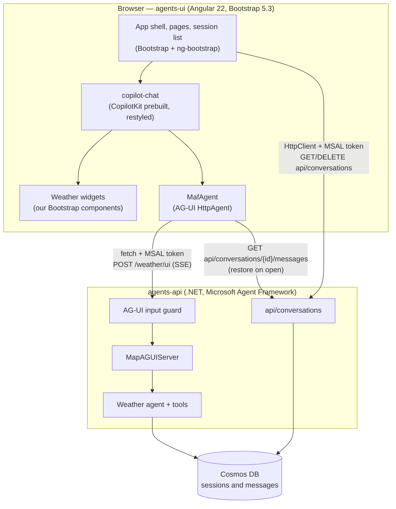

# CopilotKit chat for `agents-ui`

**Status:** Proposed — documentation only; nothing here is implemented yet.
**Date:** 2026-09-13

This package specifies a production-ready chat between the Angular app (`agents-ui/`) and the weather agent (`agents-api/`): streamed Markdown answers, weather tool calls rendered as widgets, and conversations users can keep, resume, start and delete — on desktop and mobile, in the Andes palette. It also teaches the three technologies involved, because they are new to the team and move quickly.

## Reading order

| Read | When you want to… |
| --- | --- |
| This page | See the whole picture and the vocabulary |
| [learn/01-ag-ui.md](learn/01-ag-ui.md) | Understand the protocol the chat and agent speak, and how this API speaks it today |
| [learn/02-copilotkit.md](learn/02-copilotkit.md) | Understand the chat library, its connection options, and what we override |
| [learn/03-a2ui.md](learn/03-a2ui.md) | Understand agent-described UIs and why they come later |
| [decisions.md](decisions.md) | See what was decided, what was rejected, and which risks are accepted |
| [prd.md](prd.md) | Read the requirements, epics, stories and acceptance criteria |
| [design/api.md](design/api.md) | Implement the API changes |
| [design/chat-ui.md](design/chat-ui.md) | Implement the chat — including how to reuse it in another project |
| [verification.md](verification.md) | Run the spikes, gates and acceptance checks |
| [sources.md](sources.md) | Check where a fact came from before relying on it |

The A2UI follow-up has its own PRD: [../a2ui/prd.md](../a2ui/prd.md).

## The picture

There is no server between the browser and the API: CopilotKit is configured with a self-managed agent that calls the AG-UI endpoint directly, and the API guards its input.

## Glossary

| Term | Meaning here |
| --- | --- |
| **Agent** | The weather agent: a model with three tools (`search_location`, `get_current_weather`, `get_daily_forecast`) hosted by `agents-api` |
| **AG-UI** | The event-stream protocol between an agent and a user interface — [01-ag-ui.md](learn/01-ag-ui.md) |
| **A2A** | Agent-to-agent protocol; the API also serves it, but the chat doesn't use it |
| **A2UI** | A declarative format in which the agent describes a UI from a trusted component catalog — [03-a2ui.md](learn/03-a2ui.md) |
| **CopilotKit** | The library providing the chat UI and the client-side agent engine — [02-copilotkit.md](learn/02-copilotkit.md) |
| **Thread** | One conversation; its GUID `threadId` is the Cosmos DB session id |
| **Run** | One turn: the client posts input and the agent streams events until the run finishes or fails |
| **Turn** | A user message and the agent's full reply — one run |
| **Event** | A typed JSON object in the stream (`RUN_STARTED`, `TEXT_MESSAGE_CONTENT`, `TOOL_CALL_RESULT`, …) |
| **Backend tool** | A tool the server executes (all three weather tools); the client only renders its call and result |
| **Frontend tool** | A tool the client declares and executes; rejected by this API's input guard |
| **Tool-call renderer** | A component CopilotKit shows for a named tool's call — how weather widgets appear |
| **Generative UI** | UI chosen or built by the agent: *controlled* (our components, picked by tool name), *declarative* (A2UI), *open-ended* (sandboxed UI from elsewhere) |
| **Interrupt / human-in-the-loop** | A run that pauses for the user's approval and resumes; not used |
| **Shared state** | Structured state synchronised between UI and agent; not used |
| **Activity message** | Rendering material in the stream (such as an A2UI surface) that isn't part of the conversation |
| **Self-managed agent** | A CopilotKit agent the app constructs and points at its own endpoint, with no CopilotKit runtime |
| **CopilotRuntime** | CopilotKit's optional Node server; considered and rejected |
| **Input guard** | The API filter that accepts only the trailing user text message — [design/api.md](design/api.md#a1-ag-ui-input-guard) |

## Decisions at a glance

- CopilotKit's **prebuilt chat**, restyled onto Bootstrap tokens; widgets are ours.
- **Direct connection** from the browser to the API — no Node server. CopilotKit's docs label production self-managed agents an Enterprise-tier feature: confirm terms before production.
- **API input guard**; the client mints **GUID thread ids**; sessions listed by **most recent activity**; messages capped at **4,000 characters**.
- **A2UI waits**: documented here, planned in its own PRD.
- Styling is **Bootstrap-first, mobile-first and palette-bound** — now a standing rule in `.claude/rules/ui-architecture.md`.

Full reasoning, alternatives and accepted risks: [decisions.md](decisions.md).

## What happens next

1. **API epic** ([design/api.md](design/api.md)) — the guard, tool calls on stored messages, activity ordering, readable errors.
2. **Chat UI epic** ([design/chat-ui.md](design/chat-ui.md)) — after the API epic; its first step is spikes [SPK-1 to SPK-3](verification.md#spikes), each with a fallback.
3. **Docs and operations** — runbook, configuration and hosting docs, ADR-0004 and ADR-0005, and a .NET unit-test project as a follow-up.
