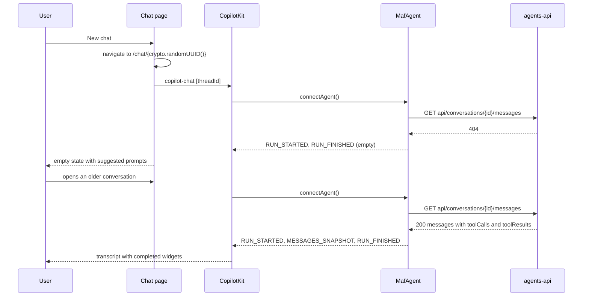

# Design B: the chat UI

The Angular work — proposed epic 2 of the [CopilotKit chat PRD](../prd.md). Nothing here is implemented yet. It follows `.claude/rules/ui-architecture.md` (placement, naming and the new Styling and layout section) and builds on the Entra ID sign-in already in `agents-ui` (see [authentication.md](../../../ui/authentication.md)). Sources are in [sources.md](../sources.md).

## Overview

- A lazy `/chat/:threadId` page with a session list (sidebar on large screens, off-canvas on small ones) and CopilotKit's prebuilt `<copilot-chat>`.
- The chat talks to the API **directly**: CopilotKit is configured with a self-managed agent, `MafAgent`, which posts runs to `/weather/ui` with a fresh Entra token and restores a conversation from `api/conversations` when a thread opens.
- Markdown is sanitized by our own renderer; the input has Stop and a busy state; weather tool calls render as Bootstrap widgets; everything is themed onto the Andes palette in both themes.

### Reusing this in another project

| Generic — copy as-is | Specific to the weather agent — replace |
| --- | --- |
| `MafAgent`, `authorized-fetch`, `to-agui-messages` | `WEATHER_AGENT_PATH` |
| `provide-chat`, `provide-tool-renderers`, `tool-call-card`, fallback renderer | `components/chat/weather/*` and `weather-tools.model.ts` |
| Safe Markdown, chat input, error alert, announcer, `chat-status-store` | Suggested prompts and labels |
| `sessions-store`, `session-list`, chat page layout | — |
| `_copilotkit.scss`, `_chat-markdown.scss` | Palette values in `styles.scss` |

Adding a widget for another tool is one component plus one `toolRenderer(...)` entry; adding another agent is another route with its own agent path and renderer set.

## Preconditions

- The API changes in [design/api.md](api.md) — the guard, tool calls on messages, CORS exposure.
- The sign-in work is committed (it landed as commit `9f1d7ec`).
- Spikes [SPK-1 to SPK-3](../verification.md#spikes) pass before the rest is built.

## Files

```
agents-ui/src/app/
├── core/
│   ├── auth/access-token-service.ts         acquire() — silent token, redirect when interaction is required
│   ├── chat/chat-agent.token.ts              CHAT_AGENT_ID ('default'), WEATHER_AGENT_PATH ('/weather/ui')
│   ├── events/chat-events.ts                 runFinished
│   └── navigation/{route-paths.ts, session-id.guard.ts}
├── services/agents/
│   ├── maf-agent-client.ts                   MafAgent extends HttpAgent
│   └── authorized-fetch.ts                   fetch wrapper adding Authorization
├── state/
│   ├── chat/chat-status-store.ts             busy, errors, announcements (route-provided)
│   └── sessions/sessions-store.ts            session list (route-provided)
├── pages/chat/
│   ├── chat.routes.ts  chat.ts/.html/.scss   the page
│   └── chat-styles.resolver.ts               loads chat.css
├── components/chat/
│   ├── provide-chat.ts                       route-scoped CopilotKit
│   ├── chat-assistant-message.ts  chat-markdown.ts  chat-input.ts/.html/.scss  chat-input-form.ts
│   ├── chat-submit-service.ts  chat-empty-state.ts  chat-error-alert.ts  session-list.ts/.html
│   ├── tools/{chat-tool-renderers.token.ts, provide-tool-renderers.ts, tool-call-card.ts, fallback-tool-renderer.ts}
│   └── weather/{provide-weather-tool-renderers.ts, location-choices.ts, current-conditions-card.ts, daily-forecast.ts}
└── shared/
    ├── models/{api/conversation.model.ts, api/problem-details.model.ts, weather/weather-tools.model.ts, tools/tool-error.model.ts}
    └── utils/{ids/session-id.ts, conversations/to-agui-messages.ts, markdown/render-markdown.ts,
               tools/tool-result-view.ts, weather/condition-icon.ts, weather/format-weather.ts,
               chat/chat-error.ts, errors/problem-message.ts, dom/load-stylesheet.ts}
agents-ui/src/styles/{chat.scss, _copilotkit.scss, _chat-markdown.scss}
```

Files the sign-in work owns that change: `app.html` (`<main class="app-main">`, a chat link), `angular.json`, `package.json`. Unchanged: `provide-auth.ts`, `auth-store.ts`, `token-refresh-service.ts`, `msal.interceptor.ts`, `main.ts`, `index.html`, the settings model and parser, `public/config.json`.

## B1. Foundations

- **`AccessTokenService.acquire()`** calls `MsalService.instance.acquireTokenSilent({ scopes: [AzureAd.Audience], account })` with the active account. `InteractionRequiredAuthError` hands off to `AuthStore.requireInteraction('token', account)` (the existing redirect path and loop breaker); no account hands off to `requireInteraction('login')`.
- **Routes.** `app.routes.ts` adds a lazy `chat` route (`loadChildren`) before `**`; the home page gets a "Start chatting" call to action; `scripts/check-initial-chunk.mjs` gains `src/app/pages/chat/chat.ts` in `pageRoots`.
- **Ids.** `newSessionId()` is `crypto.randomUUID()` — already a lowercase D-form GUID; `sessionIdGuard` (`canMatch`) accepts only D or N GUIDs, like the API.
- **Layout.** `styles.scss` makes `app-root` a full-height flex column (`100dvh`) and `.app-main` the scrolling region — about 120 bytes of initial CSS.

## B2. Agent transport

`MafAgent` is the only code that knows how this API speaks AG-UI.

```ts
// Design sketch.
export class MafAgent extends HttpAgent {
  protected override requestInit(input: RunAgentInput): RequestInit {
    const init = super.requestInit(toTrailingUserTurn(input)); // one user message; empty tools, context, state, forwardedProps
    return { ...init, headers: { ...(init.headers as Record<string, string>), Accept: 'text/event-stream, application/problem+json' } };
  }

  override run(input: RunAgentInput): Observable<BaseEvent> {
    let finished = false;
    return super.run(input).pipe(
      tap((event) => (finished ||= event.type === EventType.RUN_FINISHED || event.type === EventType.RUN_ERROR)),
      concatWith(defer(() => (finished ? EMPTY : of(runError('UPSTREAM_STREAM_ENDED'))))),
      catchError((error: unknown) => of(runErrorFrom(error))), // never error the observable
    );
  }

  protected override connect(input: RunAgentInput): Observable<BaseEvent> {
    return loadHistory(this.url, this.fetch, input.threadId).pipe(mergeMap((result) => restoreEvents(input, result)));
  }
}

export const authorizedFetch = (tokens: AccessTokenService): HttpAgentFetchFn => async (url, init) => {
  const headers = new Headers(init?.headers);
  headers.set('Authorization', `Bearer ${await tokens.acquire()}`);
  return fetch(url, { ...init, headers });
};
```

**Tokens.** `HttpAgent.run` sends every request through `this.fetch`, so the wrapper attaches a token per request. MSAL serves it from cache and renews it inside the renewal window, so there's no header bookkeeping in CopilotKit.

**Trimming** keeps the payload small and the contract clean. It is not security — the [API guard](api.md#a1-ag-ui-input-guard) is.

**Errors.** A non-2xx response becomes `Error("HTTP <status>")` with `.status` and `.payload`; a stream that ends without a terminal event is a silent failure. Both become one `RUN_ERROR` whose `message` is a code and whose `rawEvent` carries `{ status, traceId }` from the problem body.

| Result | Code |
| --- | --- |
| 400 | `INVALID_REQUEST` |
| 401 | `UNAUTHORIZED` |
| 403 | `FORBIDDEN` |
| 404 | `NOT_FOUND` |
| 409 | `CONVERSATION_BUSY` |
| 429 | `RATE_LIMITED` (with `retryAfterSeconds` from `Retry-After`) |
| 5xx | `UPSTREAM_ERROR` |
| Network failure (not a user stop) | `UPSTREAM_UNAVAILABLE` |
| Stream ended without `RUN_FINISHED` or `RUN_ERROR` | `UPSTREAM_STREAM_ENDED` |

**History restore.** CopilotKit calls `agent.connectAgent()` whenever `<copilot-chat>` binds a thread id. Our `connect()`:

- pages `GET api/conversations/{threadId}/messages` (`take=200`, newest 500 at most), deriving the URL from `this.url` and calling `this.fetch` — `clone()` copies only `url`, `headers` and `fetch`, so the agent keeps no other instance state; in-flight loads are de-duplicated in a module-level map keyed by thread id;
- emits `RUN_STARTED` · `MESSAGES_SNAPSHOT` · `RUN_FINISHED` — valid whether or not the connect path verifies events;
- on 404 (a new GUID, or a thread that isn't the caller's) emits only the bookends, so the chat opens empty;
- on 401, 403 or a server error or timeout emits `RUN_ERROR` `UNAUTHORIZED`, `FORBIDDEN` or `HISTORY_UNAVAILABLE`.

`shared/utils/conversations/to-agui-messages.ts` maps stored messages: user → `{ id, role: 'user', content }`; assistant → `{ id, role: 'assistant', content, toolCalls }`; each tool result → `{ id: \`${item.id}:${toolCallId}\`, role: 'tool', toolCallId, content }`.

## B3. Route-scoped CopilotKit

CopilotKit's module is 3.66 MB and the initial bundle is at 887.57 kB of its 900 kB warning, so CopilotKit is provided on the chat route instead of in `app.config.ts`.

```ts
// Design sketch — pages/chat/chat.routes.ts
export default [
  {
    path: '',
    providers: [provideChat(provideWeatherToolRenderers()), SessionsStore, ChatStatusStore],
    resolve: { styles: chatStylesResolver },
    children: [
      { path: '', pathMatch: 'full', redirectTo: () => newSessionId() },
      { path: ':threadId', canMatch: [sessionIdGuard], loadComponent: () => import('./chat').then((m) => m.Chat) },
    ],
  },
] satisfies Routes;

// components/chat/provide-chat.ts
export function provideChat(...features: EnvironmentProviders[]): EnvironmentProviders {
  return makeEnvironmentProviders([
    { provide: COPILOT_KIT_CONFIG, useFactory: chatConfig },
    CopilotKit,             // root-provided upstream, but it reads COPILOT_KIT_CONFIG, which exists only on this route
    CopilotkitAgentFactory, // likewise
    provideCopilotChatLabels({ chatDisclaimerText: 'Weather readings are simulated.' }),
    ...features,
  ]);
}

function chatConfig(): CopilotKitConfig {
  const agent = new MafAgent({
    url: new URL(WEATHER_AGENT_PATH, inject(APP_SETTINGS).Api.BaseUrl).href,
    fetch: authorizedFetch(inject(AccessTokenService)),
  });
  return {
    selfManagedAgents: { [inject(CHAT_AGENT_ID)]: agent },
    renderToolCalls: [...inject(CHAT_TOOL_RENDERERS).flat(), fallbackToolRenderer],
    defaultToolRendering: false,
    enableInspector: false,
  };
}
```

- With no `runtimeUrl`, CopilotKit fetches no `/info`, registers the agent immediately, and `runtimeConnectionStatus` stays `Disconnected` — **don't gate rendering on it**.
- The route's injector outlives the page, so CopilotKit, the renderers and the session list survive a trip home and back.
- **Lazy CSS.** `angular.json` lists three `inject: false` styles under `bundleName: "chat"` — `@angular/cdk/overlay-prebuilt.css` (CopilotKit's tooltips use the CDK overlay), `@copilotkit/angular/dist/styles.css`, `src/styles/chat.scss` — emitted as one `chat.css`. `chat-styles.resolver.ts` loads it through `load-stylesheet.ts`, which is idempotent and resolves on load or error so a missing file never blocks navigation.

## B4. History and new chats



CopilotKit hides its welcome screen whenever a thread id is bound, so `chat-empty-state.ts`, rendered through `messageViewChildrenComponent` when there are no messages and nothing is running, offers three suggested prompts.

**Fallback** if [SPK-2](../verification.md#spikes) fails: provide `provideCopilotChatConfiguration`, switch threads with `setActiveThreadId(id, { explicit: false })`, and call `agent.setMessages(toAguiMessages(...))` in `afterNextRender`, after CopilotKit's clearing effect.

## B5. Safe Markdown

CopilotKit's renderer writes marked output straight to `innerHTML`. Ours replaces it through the assistant-message slot.

```ts
// Design sketch — shared/utils/markdown/render-markdown.ts
const marked = new Marked({
  gfm: true,
  breaks: true,
  renderer: {
    html: ({ text }) => escapeHtml(text),  // model HTML is shown, never parsed
    image: ({ text }) => escapeHtml(text), // no remote fetches: blocks prompt-injection exfiltration
    code: ({ text, lang }) => codeBlock(text, /^[\w+-]{1,32}$/.exec(lang ?? '')?.[0]),
  },
});

export function renderMarkdown(source: string): string {
  return purify.sanitize(marked.parse(completePartialMarkdown(source)) as string, {
    USE_PROFILES: { html: true },
    FORBID_TAGS: ['img', 'picture', 'video', 'audio', 'iframe', 'object', 'embed', 'form', 'input', 'button', 'select', 'textarea', 'style', 'link', 'meta', 'base'],
    FORBID_ATTR: ['style', 'id', 'name'], // id and name enable DOM clobbering
    ALLOWED_URI_REGEXP: /^(?:https?:|mailto:)/i,
    ADD_ATTR: ['target'],
  });
}
```

- A DOMPurify hook adds `target="_blank" rel="noopener noreferrer nofollow"` to links and `table table-sm` to tables.
- `completePartialMarkdown` (from `@copilotkit/core`) closes half-streamed constructs, as CopilotKit's renderer does.
- `chat-markdown.ts` binds `[innerHTML]` — Angular sanitizes again, and no `bypassSecurityTrust*` is used; its host carries `app-bs-island not-prose`.
- `chat-assistant-message.ts` wraps `<copilot-chat-assistant-message … [markdownRendererComponent]="ChatMarkdown">` and hides regenerate and edit, which would resend a stored message ([SPK-5](../verification.md#spikes)).

## B6. Input

`chat-input.ts`, passed as `[inputComponent]`:

- A Bootstrap `input-group` with a textarea that grows (`field-sizing: content`, capped at `40dvh`), a visually hidden label and an `n / 4,000` counter; Signal Forms enforce the cap from `chat-input-form.ts` (a plain signal if [SPK-8](../verification.md#spikes) finds problems).
- Enter sends, Shift+Enter adds a line; Enter never sends during IME composition or on a coarse pointer.
- Send is disabled while a run is active. **Stop** (`core.stopAgent({ agent })`) appears only for runs this client started, followed by "Stopped — this reply may not be saved", because the API saves nothing for an abandoned stream.
- `chat-submit-service.ts` (provided by the input, where CopilotKit's `ChatState` resolves) ignores blank or busy submits, marks the run as requested, then calls `chat.submitInput(text)`.

## B7. Status, errors and accessibility

`chat-status-store.ts` (route-provided) subscribes to `core.subscribe({ onError })`, exposes `busy = runRequested || isRunning` (`isRunning` is also true while connecting), and when a run it requested goes from running to idle dispatches `chatEvents.runFinished` and sets an announcement.

`shared/utils/chat/chat-error.ts` turns error codes into what the user reads. It never shows `error.message`, and appends "Reference: {traceId}" when there is one.

| Code | Message | Action |
| --- | --- | --- |
| `UNAUTHORIZED` | Your sign-in has expired. | Sign in (`AuthStore.retrySignIn()`) |
| `FORBIDDEN` | Your account doesn't have access to this agent. | — |
| `NOT_FOUND` during a run | This conversation no longer exists. | New chat |
| `CONVERSATION_BUSY`, `agent_thread_locked` | This conversation is still finishing a reply. Try again in a moment. | — |
| `RATE_LIMITED` | You've reached the message limit for now. Try again in {n} seconds. | — |
| `INVALID_REQUEST` | That message couldn't be sent. Messages can be up to 4,000 characters. | — |
| `UPSTREAM_ERROR` / `UPSTREAM_UNAVAILABLE` / `UPSTREAM_STREAM_ENDED` | The agent ran into a problem. / The agent is unavailable right now. / The reply was cut off before it finished. | — |
| `HISTORY_UNAVAILABLE`, `agent_connect_failed` | Earlier messages couldn't be loaded. | Reload |
| offline | You appear to be offline. | — |
| anything else | Something went wrong. | — |

`chat-error-alert.ts` renders a Bootstrap alert with `role="alert"`, the action button and a close button.

**Accessibility**

- A page-level `visually-hidden` `aria-live="polite"` region announces "Agent is responding", "Reply complete", "Stopped" and "Opened {title}". The transcript isn't a live region, which would read tokens out one by one.
- After a thread switch, focus moves to the textarea; after a delete, to the session-list heading.
- Every interactive element is at least 24×24 px; widgets are `section.card` with an `aria-label`, `aria-busy` while pending; tables have `th scope="col"`.
- `prefers-reduced-motion` stops CopilotKit's animations (in the theme partial).

## B8. Tool widgets

**Contracts.** `shared/models/weather/weather-tools.model.ts` holds zod schemas and inferred types for the tools' arguments and results; `shared/models/tools/tool-error.model.ts` holds `{ error }`. Field casing is confirmed against a real `TOOL_CALL_RESULT` recorded in [SPK-1](../verification.md#spikes).

| Tool | Arguments | Result |
| --- | --- | --- |
| `search_location` | `query` | `LocationResult[]` (`name`, `country`, `latitude`, `longitude`) |
| `get_current_weather` | `locationName`, `latitude`, `longitude` | `CurrentConditionsResult` (`location`, `observedAt`, `localDate`, `conditions`, `temperatureC`, `temperatureF`, `feelsLikeC`, `humidityPercent`, `windSpeedKph`, `windDirection`, `precipitationChancePercent`) |
| `get_daily_forecast` | the above plus `days` | `DailyForecastResult` (`location`, `days[]` with `date`, `conditions`, `highC`, `lowC`, `highF`, `lowF`, `precipitationChancePercent`, `windSpeedKph`) |

**View states.** `tool-result-view.ts` turns a tool call into `pending | no-result | tool-error | invalid | ok`. The prebuilt chat only reports `executing` then `complete`, and a restored call without a result never completes — so a call that isn't complete is `pending` while a run is active and `no-result` otherwise.

**The reusable pattern.**

```ts
// Design sketch — components/chat/weather/provide-weather-tool-renderers.ts
export const provideWeatherToolRenderers = () =>
  provideToolRenderers([
    toolRenderer({ name: 'search_location', args: searchLocationArgsSchema, component: LocationChoices }),
    toolRenderer({ name: 'get_current_weather', args: currentWeatherArgsSchema, component: CurrentConditionsCard }),
    toolRenderer({ name: 'get_daily_forecast', args: dailyForecastArgsSchema, component: DailyForecast }),
  ]);

// Each widget follows the same shape.
export class CurrentConditionsCard implements ToolRenderer<CurrentWeatherArgs> {
  readonly toolCall = input.required<AngularToolCall<CurrentWeatherArgs>>();
  private readonly agent = injectAgentStore(inject(CHAT_AGENT_ID));
  protected readonly view = computed(() =>
    toolResultView(this.toolCall().status, this.toolCall().result, this.agent().isRunning(), currentConditionsResultSchema));
}
```

- `tool-call-card.ts` is the shared shell: a `placeholder-glow` skeleton, a friendly tool-error alert, invalid and no-result states, and `<ng-content>` for the result; its root carries `app-bs-island not-prose`.
- `fallback-tool-renderer.ts` handles any other tool (`*`) with its name and a status badge — never raw JSON.
- Weather widgets: `location-choices` (a list group), `current-conditions-card` (condition icon, °C and °F, feels like, a grid of humidity, wind and rain chance), `daily-forecast` (a list group below `md`, a small table from `md`). `condition-icon.ts` maps the ten stub conditions to Bootstrap Icons; `format-weather.ts` formats units and UTC-safe dates.

## B9. Theming

`src/styles/chat.scss` is the lazy entry: `@use 'copilotkit'; @use 'chat-markdown';`.

```scss
// Design sketch — src/styles/_copilotkit.scss (excerpt)
:root[data-bs-theme='light'] { --app-on-primary: var(--bs-white); }
:root[data-bs-theme='dark']  { --app-on-primary: var(--bs-body-bg); } // Ink on Glacier Blue, as .btn-primary does

:root [data-copilotkit] {
  --cpk-default-font-family: var(--bs-body-font-family);
  --copilot-kit-primary-color: var(--bs-primary);
  --copilot-kit-contrast-color: var(--app-on-primary);
  --copilot-kit-background-color: var(--bs-body-bg);
  --copilot-kit-separator-color: var(--bs-border-color);
  --background: var(--bs-body-bg);
  --foreground: var(--bs-body-color);
  --primary: var(--bs-primary);
  --primary-foreground: var(--app-on-primary);
  --muted-foreground: var(--bs-secondary-color);
  --border: var(--bs-border-color);
  --ring: var(--bs-focus-ring-color);
  --radius: var(--bs-border-radius-lg);
  // …every other --copilot-kit-* and shadcn variable, mapped the same way
}
```

- `:root [data-copilotkit]` outranks CopilotKit's own `.dark [data-copilotkit]` declarations, and the variables are re-mapped on every nested `[data-copilotkit]` host.
- CopilotKit's dark variant is `&:is(.dark *)`, so `ThemeStore` also toggles `.dark` on `<html>` alongside `data-bs-theme`.
- Bootstrap's Reboot is unlayered and beats CopilotKit's layered base styles; `revert-layer` hands those properties back on CopilotKit's markup (excluding `.app-bs-island`). The exact property list comes from the computed-style diff in [SPK-5](../verification.md#spikes).
- Hard-coded colors in CopilotKit's `dark:` utilities and `.prose a` are overridden; no `!important` is used.
- `_chat-markdown.scss` styles code on `--bs-tertiary-bg` with `--bs-emphasis-color`, borders blockquotes, and lets tables scroll at 360 px.
- Only `<copilot-chat>` is used; the sidebar and popup variants sit above Bootstrap's modal layers.

## B10. Sessions and the page

- **`sessions-store.ts`** (route-provided) calls `api/conversations` through `HttpClient`, so the existing `msalInterceptor` attaches the token. It keeps **server order** (most recent activity first) with `withEntities`; `load` (`switchMap`, `take=50`), `loadMore` (`exhaustMap`) and `remove` (`concatMap`, where 204 or 404 removes the entry). On `runFinished` it upserts the session and moves it to the top, retrying a 404 twice at 750 ms because the Cosmos save follows `RUN_FINISHED`.
- **`session-list.ts`** is a `<nav>` with a flush list group of `<a routerLink>` items (`aria-current` on the active one), a delete button per item, Load more and an empty state. Delete confirms in an `NgbModal` opened from a template (so the route injector is kept); deleting the active conversation starts a new one.
- **`chat.ts`** lays out a `row g-0 h-100`: a `col-lg-3 d-none d-lg-flex` sidebar and a `col-12 col-lg-9` chat column. The header holds a `d-lg-none` button that opens the session list in `NgbOffcanvas` (`position: 'start'`, dismissed at ≥ 992 px), the conversation title and **New chat**; below it the error alert and `<copilot-chat [agentId] [threadId] [inputComponent] [assistantMessageComponent] [messageViewChildrenComponent]>`.

## B11. Dependencies and build

| Package | Version | Why |
| --- | --- | --- |
| `@copilotkit/angular` | `0.5.2` exact | The chat |
| `@copilotkit/core` | `1.70.2` exact | Pinned by the Angular package; `completePartialMarkdown` |
| `@ag-ui/client` | `0.0.59` exact | `HttpAgent`; pinned by CopilotKit |
| `@angular/cdk` | `^22.1.0` | CopilotKit peer |
| `zod` | `3.25.76` exact | Tool contracts; dedupes with CopilotKit's |
| `marked`, `dompurify` | `18.0.13`, `3.4.15` exact | Safe Markdown |

- `"overrides": { "rxjs": "$rxjs" }` — `@ag-ui/client` and `@copilotkit/core` pin rxjs 7.8.1 exactly; the override keeps the workspace's single 7.8.2.
- Budgets: the initial budget stays at 900 kB / 1 MB; add a `bundle` budget for `chat` CSS (100 kB / 150 kB) and an `anyScript` budget set from the largest lazy chunk measured in [SPK-1](../verification.md#spikes).
- `check-initial-chunk.mjs` also fails when anything from `@copilotkit`, `@ag-ui`, `@angular/cdk`, `marked`, `dompurify`, `highlight.js`, `katex` or `zod` reaches the initial chunk, or when `chat.css` is missing or linked from `index.html`.

## B12. Tests

Vitest 4 on jsdom with a zoneless `TestBed`.

- **Fixtures** (`src/testing/`): a fake `CopilotKit` and agent store, conversation DTO builders, recorded weather tool results, and the Markdown XSS corpus.
- **Transport**: `maf-agent-client.spec.ts` with a fake `fetch` — trimmed body and `Accept` header; a token per request; each status to its `RUN_ERROR` code with trace id; a stream that ends without a terminal event; `connect` for 200, 404 and 401; de-duplicated history loads; `clone()` keeps the subclass. Plus `authorized-fetch.spec.ts` and `to-agui-messages.spec.ts`.
- **Pure utilities**: `render-markdown` (the corpus renders no script, media, event handlers, dangerous links, `id` or `name`), `tool-result-view`, `condition-icon`, `format-weather`, `chat-error` (every row), `session-id`.
- **Stores**: `sessions-store` (`HttpTestingController`), `chat-status-store`, `theme-store` (`.dark`).
- **Components and routes**: `chat-input` (double Enter sends once, busy, Stop, cap, IME), `chat-markdown`, every weather widget state, the fallback renderer, the error alert, the session list, `access-token-service`, `session-id.guard`, and the chat route (redirect to a GUID).

## B13. Verification and follow-through

- Gate [GATE-UI](../verification.md#gates) and the browser checks [UI-NET to UI-MOTION](../verification.md#chat-ui-acceptance-checks).
- Reviews with the `code-review` and `security-review` skills.
- Docs when it ships: `docs/ui/angular-workspace.md`, `docs/ui/authentication.md` (the chat's token use), the `agents-ui` section of `.claude/CLAUDE.md`, ADR-0004, and a CHANGELOG entry.
