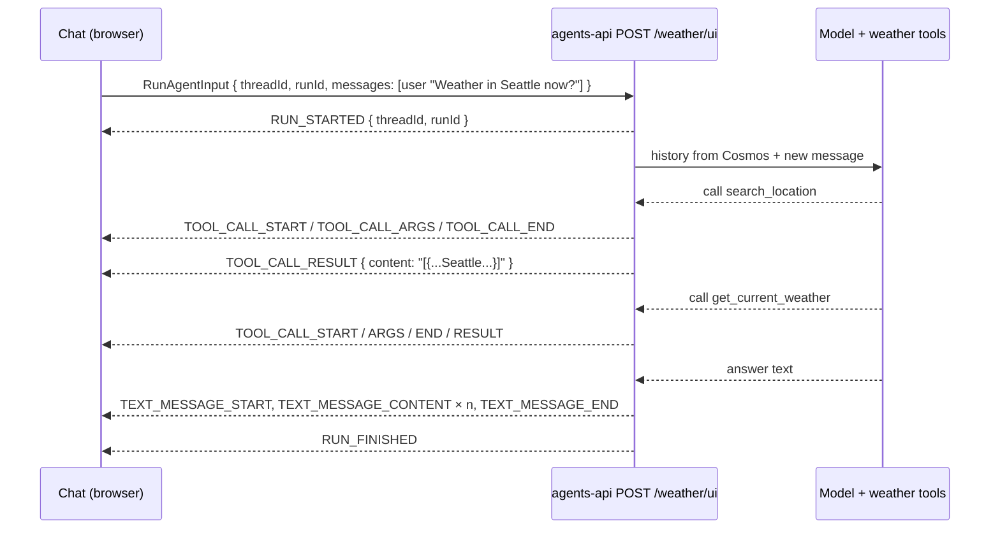

# AG-UI: the protocol between the chat and the agent

This is the first of three learning docs in the [CopilotKit chat PRD package](../README.md). It explains what AG-UI is, what travels over the wire, and how this repository's weather agent speaks it today. Every fact is sourced in [sources.md](../sources.md#ag-ui-protocol), verified on 2026-09-13.

## Why AG-UI exists

An agent turn isn't a single request and response. Text streams token by token, tools run in the middle of the answer, and the agent may pause to ask the user something. A plain REST call can't express that, so every agent framework used to invent its own streaming format — and every UI had to be written against one framework.

AG-UI (Agent–User Interaction protocol) standardizes the **event stream between an agent backend and a user-facing application**. Any AG-UI client can talk to any AG-UI agent: CopilotKit's chat components on one side, Microsoft Agent Framework, LangGraph or CrewAI on the other.

It is one of three protocols that are easy to confuse:

| Protocol | Connects | In this repository |
| --- | --- | --- |
| **A2A** (Agent-to-Agent) | an agent to another agent or a program | `weather/a2a` — for callers that aren't browsers |
| **AG-UI** | an agent to a user interface | `weather/ui` — what the chat uses |
| **A2UI** | not a transport: a format for *describing* a UI that can travel over A2A or AG-UI | not used yet — see [03-a2ui.md](03-a2ui.md) |

## The mental model: threads, runs and events

- A **thread** is a conversation. Here it is the Cosmos DB session, identified by a GUID `threadId`.
- A **run** is one turn. The client posts the run's input; the agent answers with a stream of events until the run finishes or fails.
- An **event** is a small JSON object with a `type`. The client folds events into the transcript: text deltas become an assistant message, tool events become a tool call and its result.

A typical turn against the weather agent:



## The request: `RunAgentInput`

The client sends one JSON object per run. The table shows what each field means in the protocol and what this API does with it once the input guard in [design/api.md](../design/api.md#a1-ag-ui-input-guard) is in place.

| Field | Protocol meaning | This API (with the guard) |
| --- | --- | --- |
| `threadId` | Conversation id | Must be a GUID. The chat mints a lowercase GUID for a new conversation; a blank id still gets a server-issued one |
| `runId`, `parentRunId` | Id of this run and the run it continues | Echoed back in `RUN_STARTED` and `RUN_FINISHED`. Always send a `runId`: a blank one is echoed as `""` |
| `messages` | The conversation so far | Only the **trailing user text message** is used. History comes from Cosmos DB, so earlier messages are ignored |
| `tools` | Tools the *client* offers the agent (frontend tools) | Must be empty — otherwise 400 |
| `context`, `state`, `forwardedProps` | App context, shared state, pass-through data | Must be empty — otherwise 400 |
| `resume` | Answers to a human-in-the-loop interrupt | Must be empty — otherwise 400 |

**Why the guard matters.** Today, without it, the host saves every message the client sends into Cosmos DB — a `system` or `assistant` message included — and lets client-declared tools reach the model. Microsoft's own guidance names these as prompt-injection vectors; see [Security](#security-why-the-api-guards-its-input).

## The response: the event catalog

| Event | What it means | Emitted by this API today? |
| --- | --- | --- |
| `RUN_STARTED` | A run began; carries `threadId` and `runId` | Yes |
| `TEXT_MESSAGE_START` / `_CONTENT` / `_END` | An assistant message streaming in deltas | Yes |
| `TOOL_CALL_START` / `_ARGS` / `_END` | The agent called a tool; `ARGS` carries the arguments | Yes — the arguments arrive in one `ARGS` event |
| `TOOL_CALL_RESULT` | The tool's output | Yes — `content` is the tool's JSON as a string |
| `REASONING_*` | The model's reasoning (often encrypted) | Possibly |
| `RUN_FINISHED` | The run completed; may carry an `outcome` (success or interrupt) | Yes |
| `RUN_ERROR` | The run failed | **No, not after the stream has started** — see [Errors](#errors-before-and-after-the-stream-starts) |
| `STATE_SNAPSHOT` / `STATE_DELTA` | Shared state between UI and agent | No — no state mapping is configured |
| `MESSAGES_SNAPSHOT` | The full transcript at once | No — the .NET host never emits it |
| `ACTIVITY_SNAPSHOT` / `_DELTA` | Rendering material such as an A2UI surface (new in the 1.0 draft) | No |
| `STEP_*`, `CUSTOM`, `RAW` | Sub-steps, app-defined events, wrapped foreign events | No |

Most text and tool events also carry a `rawEvent` field with the provider's raw update. Clients should ignore it.

## Errors before and after the stream starts

Where an error surfaces depends on whether the first event has already been sent.

**Before the first event** the response hasn't started, so the API answers with an HTTP status and an RFC 9457 problem body: 400 `validation-error` (for example a non-GUID `threadId`), 401, 403 `forbidden` (a token without `oid`), 415, 429 `too-many-requests`.

Two details trip up an AG-UI client:

- ASP.NET only writes the problem body when the request's `Accept` header admits JSON, and AG-UI clients send `Accept: text/event-stream`. The chat's agent therefore sends `Accept: text/event-stream, application/problem+json`, and the API design adds a fallback writer so a body is written either way.
- CORS exposes no response headers today, so a browser can't read `Retry-After` on a 429. The API design exposes it.

**After the first event** the pinned hosting package (AGUI.Server 0.0.5) rethrows the failure and the **connection simply drops** — no `RUN_ERROR`. That includes the 409 `conversation-busy` raised when two turns race on one thread. A client must therefore treat a stream that ends without `RUN_FINISHED` or `RUN_ERROR` as a failure; the chat's agent turns that into an `UPSTREAM_STREAM_ENDED` error. Newer AG-UI builds do emit `RUN_ERROR`, so an upgrade changes this behavior.

## Try it with curl

Get a token as described in the [runbook](../../../operations/runbook.md#get-a-token), then start a conversation with a GUID you mint yourself:

```bash
THREAD=$(uuidgen | tr 'A-Z' 'a-z')
curl -N https://localhost:7237/weather/ui \
  -H "Authorization: Bearer $TOKEN" \
  -H "Content-Type: application/json" \
  -H "Accept: text/event-stream, application/problem+json" \
  -d "{
    \"threadId\": \"$THREAD\",
    \"runId\": \"$(uuidgen | tr 'A-Z' 'a-z')\",
    \"messages\": [ { \"id\": \"m1\", \"role\": \"user\", \"content\": \"What's the weather in Seattle right now?\" } ]
  }"
```

The output is one `data:` line per event:

```text
data: {"type":"RUN_STARTED","threadId":"…","runId":"…"}
data: {"type":"TOOL_CALL_START","toolCallId":"call_…","toolCallName":"search_location",…}
data: {"type":"TOOL_CALL_ARGS","toolCallId":"call_…","delta":"{\"query\":\"Seattle\"}"}
data: {"type":"TOOL_CALL_END","toolCallId":"call_…"}
data: {"type":"TOOL_CALL_RESULT","toolCallId":"call_…","content":"[{\"name\":\"Seattle\",…}]"}
…
data: {"type":"TEXT_MESSAGE_CONTENT","messageId":"…","delta":"It's currently"}
…
data: {"type":"RUN_FINISHED","threadId":"…","runId":"…"}
```

To continue the conversation, send the same `threadId` with only the next user message. Don't resend the earlier messages: the server already has them.

## The TypeScript client: `@ag-ui/client`

The browser side of AG-UI is `@ag-ui/client` (0.0.59). Its `HttpAgent` is what CopilotKit drives under the hood.

| Member | What it does |
| --- | --- |
| `new HttpAgent({ url, headers, fetch })` | Points the agent at an AG-UI endpoint. `fetch` replaces the global `fetch` for every request |
| `run(input)` | Posts `requestInit(input)` to `url` and returns an `Observable` of events |
| `requestInit(input)` (protected) | Builds the `fetch` options — the documented place to customize the request |
| `runAgent()` / `connectAgent()` | Higher-level entry points that build the input from the agent's own `messages` and apply the resulting events |
| `connect(input)` (protected) | Re-attaches to an existing thread. **Not implemented by default** — it throws |
| `clone()` | Copies `url`, `headers` and `fetch`, keeping a subclass's prototype |

Four behaviors matter for this repository, and the [chat design](../design/chat-ui.md#b2-agent-transport) answers each one:

| Default behavior | Why it's a problem here | What the chat does |
| --- | --- | --- |
| `runAgent` sends the **whole** message history on every run | The API only wants the new message | A subclass overrides `requestInit` to send the trailing user message |
| No per-run headers, and access tokens expire | Every request needs a fresh Entra token | The agent's `fetch` wrapper acquires a token per request |
| `connect()` isn't implemented | Opening a past conversation would show nothing | The subclass implements `connect()` by loading `api/conversations/{id}/messages` |
| Non-2xx becomes `Error("HTTP <status>")` and a dropped stream just ends | The user would see nothing useful | The subclass turns both into one `RUN_ERROR` with a code |

It also pins `rxjs` to 7.8.1 exactly, while the workspace uses 7.8.2; an npm `overrides` entry keeps a single copy in the bundle.

## Security: why the API guards its input

Microsoft's [security guidance for AG-UI](https://learn.microsoft.com/agent-framework/integrations/by-component/ui/ag-ui/security-considerations) treats everything a client sends as untrusted and names five injection vectors:

| Vector | The attack | Mitigation in this design |
| --- | --- | --- |
| Messages | Inject `system`, `assistant` or `tool` messages to rewrite the agent's instructions or history | Only the trailing `user` text message is used; nothing else reaches the model or Cosmos DB |
| Client tools | Declare a tool whose description manipulates the model | Non-empty `tools` is rejected |
| State | Hide instructions in shared state | Non-empty `state` is rejected |
| Context | Hide instructions in context items | Non-empty `context` is rejected |
| Forwarded properties | Smuggle data to downstream systems | Non-empty `forwardedProps` is rejected |

The guidance also says "Do not expose AG-UI servers directly to untrusted clients (e.g., JavaScript running in browsers)" and recommends a trusted frontend server. This design deliberately connects the browser directly, and relies on the guard plus the API's existing Entra ID authentication, per-user session scoping and per-user rate limit — the validation Microsoft requires when a server *is* exposed directly. The trade-off is recorded in [decisions.md](../decisions.md).

A thread id is not proof of ownership. The API already scopes every session by the caller's Entra object id, so sending someone else's `threadId` opens an empty conversation of your own.

## Maturity and what to watch

- The specification is a **1.0 draft**, not ratified; interrupts, reasoning and activity events are still marked draft even though SDKs ship them.
- The TypeScript SDK is **0.0.59**, and CopilotKit pins it exactly.
- The .NET hosting package is a **preview**, pinned exactly by [ADR-0001](../../../adr/0001-preview-hosting-packages.md); upgrading changes stream-error behavior (`RUN_ERROR` on failure).

Next: [02-copilotkit.md](02-copilotkit.md) — the UI layer that sits on top of this protocol.
