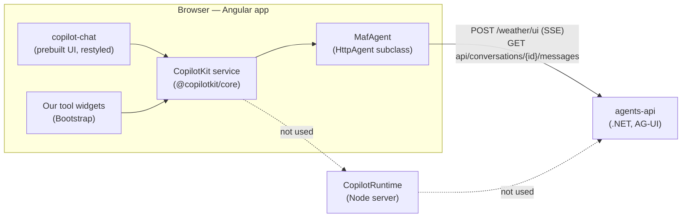

# CopilotKit: the chat UI layer

The second learning doc in the [CopilotKit chat PRD package](../README.md). It explains what CopilotKit is, the choices it offers, which ones this design makes, and the surprises found in its Angular package. Facts are sourced in [sources.md](../sources.md#copilotkit), verified on 2026-09-13.

## What CopilotKit is

CopilotKit is a frontend stack for agent user interfaces. In its own words, "AG-UI handles the wire protocol, CopilotKit handles the UI layer for each framework". It ships chat components, state for agent runs, and a way to render tool calls as custom components, for React, Angular, Vue and other clients. The libraries are MIT-licensed; CopilotKit also sells a hosted "Intelligence" tier (durable threads, inspection, analytics).

The design uses three packages and deliberately leaves out a fourth:

| Package | Version | Role |
| --- | --- | --- |
| `@copilotkit/angular` | 0.5.2 | Angular components, signals and providers |
| `@copilotkit/core` | 1.70.2 (pinned by the Angular package) | Framework-neutral engine: agent registry, runs, errors |
| `@ag-ui/client` | 0.0.59 (pinned by both) | The AG-UI transport — see [01-ag-ui.md](01-ag-ui.md#the-typescript-client-ag-uiclient) |
| `@copilotkit/runtime` | 1.71.1 | **Not used.** A separate Node server — see below |

## How the pieces fit

## Connecting an agent: runtime or self-managed

CopilotKit can reach an agent in three ways. This is the most consequential choice in the design.

| | Runtime (`runtimeUrl`) | Self-managed (`selfManagedAgents`) | Local (`agents`) |
| --- | --- | --- | --- |
| **What it is** | The browser talks to a CopilotKit **Node server**, which calls the agent | The browser talks to **your agent endpoint** directly through an AG-UI client you construct | Same wiring as self-managed |
| **What it adds** | Header forwarding, in-memory thread replay, server middleware (including A2UI), request hooks | Nothing — your endpoint must authenticate and authorize every request | Nothing |
| **Hosting** | An extra process to build, deploy and operate ("Angular has no route handler, so Copilot Runtime is a separate process from your app") | None beyond the agent | None |
| **CopilotKit's docs say** | The documented path for Microsoft Agent Framework .NET | "Production, agents you manage" — and "`selfManagedAgents` is part of CopilotKit's Enterprise Intelligence tier. Talk to an engineer about licensing for production use." | "Local dev / prototyping" only |
| **This design** | Rejected by the owner: an extra deployable the app doesn't need | **Chosen** | — |

Why self-managed fits this repository: the .NET API already authenticates every request with Entra ID, scopes each session to the caller, rate-limits agent turns per user, and — with the planned input guard — validates what the browser sends. A runtime in between would duplicate those duties.

**The license caveat.** The npm package is MIT and its code performs no license check, so self-managed agents work without a key. CopilotKit's documentation nonetheless labels production use as an Enterprise-tier feature. Confirm the terms with CopilotKit before going live; [decisions.md](../decisions.md) tracks this as an accepted risk.

## Prebuilt or headless

| | Prebuilt | Headless |
| --- | --- | --- |
| **You get** | `<copilot-chat>` (plus sidebar and popup variants): transcript, input box, streaming, tool-call rendering and layout | The engine only: `injectAgentStore()` (messages, running flag as signals), `core.runAgent()` / `core.stopAgent()`, renderer registries |
| **You write** | Style overrides, and optional **slot** components that replace parts (assistant message, input, the area under the messages) | Every piece of markup |
| **Look** | CopilotKit's Tailwind-based design, re-themed through CSS variables | Fully yours |

**This design:** the app shell and pages are Bootstrap; the chat is the **prebuilt** `<copilot-chat>`, re-themed onto Bootstrap tokens; three slots are replaced — the assistant message (to sanitize Markdown), the input (to add Stop and a busy state), and the message-area children (an empty state). Tool-call widgets are our own Bootstrap components.

## The APIs this design relies on

| API | What it does | Used for |
| --- | --- | --- |
| `provideCopilotKit(config)` / `COPILOT_KIT_CONFIG` | Configures the `CopilotKit` service | Provided on the chat route only, to keep the package out of the initial bundle |
| `<copilot-chat [agentId] [threadId]>` | The chat; binding `threadId` connects the agent to that conversation | One chat per route; the URL's thread id is bound |
| `renderToolCalls` with a component taking `toolCall = input.required<AngularToolCall>()` | Renders a named tool's call; `toolCall` carries `status`, `args` and `result` (a string) | Weather widgets and a fallback |
| `injectAgentStore(agentId)` | Signals for `messages` and `isRunning` | Busy state, empty state, "run finished" detection |
| `core.subscribe({ onError })` | Error notifications with a code | Our Bootstrap error alert |
| `core.stopAgent({ agent })` | Aborts the current run | The Stop button |
| `inputComponent`, `assistantMessageComponent`, `messageViewChildrenComponent` | Slot inputs on `<copilot-chat>` | Our input, safe Markdown, empty state |
| `provideCopilotChatLabels({...})` | Text such as the placeholder and disclaimer | Wording |

## What surprised us, and how the design handles it

Reading the published 0.5.2 build turned up behavior the documentation doesn't mention. Each item is a design input for [design/chat-ui.md](../design/chat-ui.md).

| Finding | Consequence | Design response |
| --- | --- | --- |
| The docs say to register `provideCopilotKit` in `app.config.ts`; the package is one 3.66 MB module with Markdown, syntax-highlighting and maths libraries | The initial bundle is already at 887.57 kB of a 900 kB warning budget | Provide CopilotKit on the lazy chat route (re-providing `CopilotKit` and `CopilotkitAgentFactory`); load its CSS lazily — spike [SPK-1](../verification.md#spikes) |
| Binding `threadId` calls the agent's `connect()`, which `HttpAgent` doesn't implement | A past conversation opens empty | Our agent implements `connect()` by loading stored messages — [SPK-2](../verification.md#spikes) |
| Assistant Markdown is written to `innerHTML` with **no sanitization** | A prompt-injected reply could run script in the user's session | Replace the renderer through the assistant-message slot with marked + DOMPurify |
| No Stop button; pressing Enter mid-run starts another run | The API answers a concurrent turn with a 409 that drops the stream | Custom input: send disabled while running, Stop calls `core.stopAgent` |
| Errors only reach `console.error` | Users see nothing when a turn fails | Subscribe to `core.onError`; show a Bootstrap alert |
| Tool status goes `executing` → `complete` only; a restored call with no result stays `executing` forever | A widget can spin indefinitely | A "no result" state once no run is active |
| Dark mode keys off a `.dark` class; Bootstrap's unlayered Reboot overrides CopilotKit's layered utilities; typography rules restyle markup inside messages | Wrong colors and spacing, widgets restyled | Theme partial mapping CopilotKit variables to `--bs-*`, `.dark` toggled with the theme, `app-bs-island not-prose` on our markup — [SPK-5](../verification.md#spikes) |
| No live region announces replies | Screen-reader users aren't told a reply arrived | Our own `aria-live` announcer |
| The welcome screen is hidden whenever a thread id is bound | New chats open blank | Our empty state with suggested prompts |
| Without `runtimeUrl`, `runtimeConnectionStatus` stays `Disconnected` | Gating on it would never render the chat | Don't gate on connection status |
| `CopilotInspector` is always created at the root and isn't exported | One console error in development when CopilotKit is route-scoped | Documented; `enableInspector: false` |

## Generative UI in CopilotKit's terms

CopilotKit sorts agent-driven UI into three kinds:

- **Controlled** — you wrote the component, the agent only picks it (tool-call renderers). **This design.**
- **Declarative** — the agent emits a structured UI description rendered from a catalog you registered (A2UI). **Later** — see [03-a2ui.md](03-a2ui.md) and the [A2UI PRD](../../a2ui/prd.md).
- **Open-ended** — the UI is built elsewhere (an MCP server) and sandboxed. Not planned.

## What we deliberately don't use

| Feature | Why not |
| --- | --- |
| CopilotRuntime | Owner decision; the API already covers its duties |
| Frontend tools and human-in-the-loop | The API guard rejects client tools and `resume`; no use case yet |
| CopilotKit threads (Intelligence) | Conversations already live in Cosmos DB behind `api/conversations` |
| Sidebar and popup variants | The chat is a full page; their z-index sits above Bootstrap's modals |
| Inspector, suggestions, attachments, voice | Not needed for the weather agent |

## Maturity and revisit triggers

- The Angular package is **0.x** and moves quickly: 0.3 → 0.5 in five weeks, narrowing Angular support to 22 only. It pins `@copilotkit/core` and `@ag-ui/client` exactly, so upgrades arrive on CopilotKit's schedule.
- Open issues worth watching: [#5428](https://github.com/CopilotKit/CopilotKit/issues/5428) (Stop button), [#6714](https://github.com/CopilotKit/CopilotKit/issues/6714) (Angular developer-experience feedback), [#6574](https://github.com/CopilotKit/CopilotKit/issues/6574) (observable thread changes), [PR #5147](https://github.com/CopilotKit/CopilotKit/pull/5147) (pluggable Markdown renderer).
- Revisit the design when CopilotKit clarifies self-managed licensing, ships a sanitized or pluggable Markdown renderer, or adds a Stop button — each would remove custom code.

Next: [03-a2ui.md](03-a2ui.md) — agent-described interfaces.
